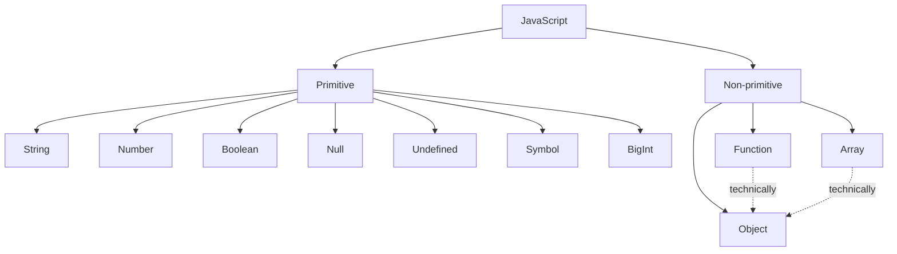
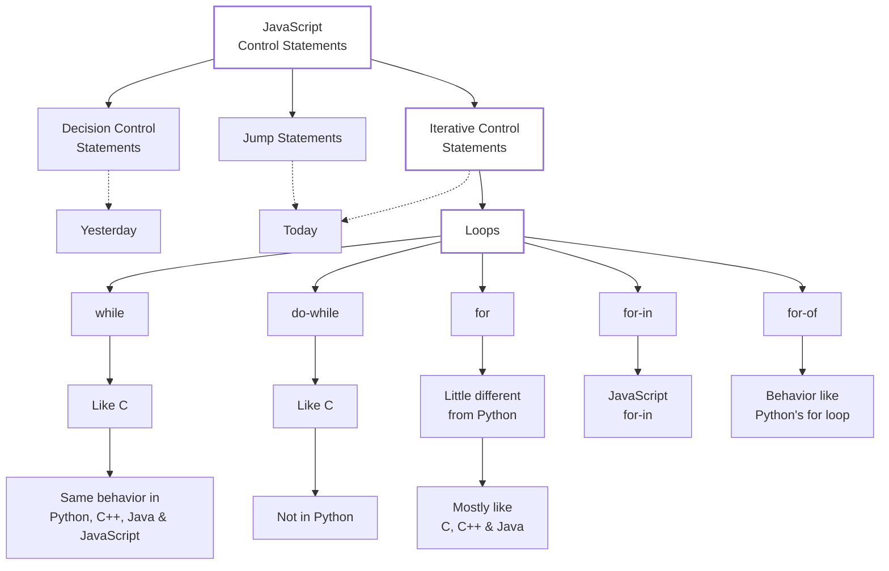

### Prerequisites


# Loops and Jump statements


### `for-in` & `for-of` Loops

> `while`, `do-while` & `for` in JavaScript are like C; now we see `for-in` & `for-of`.

#### `for-in` Loop

```js
for (let V in object) {
    // code
}
```

- `V` contains **property names (keys)**, one by one.
- For an object, use `object[V]` to access the corresponding value.

```js
const p1 = {
    name: "Rahul",
    age: 22,
    city: "Bhopal",
    f1: function () {
        console.log("Hello");
    }
};

for (let prop in p1) {
    console.log(prop, p1[prop]);
}
```

`p1.prop` → `undefined` because there is no property named `prop`.

#### `for-of` Loop

```js
for (let V of iterable) {
    // code
}
```

- `V` contains **values**, one by one.
- Arrays are iterable.

```js
let a = [11, 22, 33, 44];

for (let V of a) {
    console.log(V);
}
```

Output:
```text
11
22
33
44
```

**Remember:**

- `for-in` → **keys / property names**
- `for-of` → **values**

#### Iterables & Objects

- **All iterables are objects.**
- Arrays, functions & objects are objects.
- Therefore, an **array** can be used with both `for-in` and `for-of`.

```js
let a = [11, 22, 33, 44];

for (let V in a) {
    console.log(V, a[V]);
}
```

`for-in` → `V` gets the **index (key)** → `0, 1, 2, 3`

```js
for (let V of a) {
    console.log(V);
}
```

`for-of` → `V` gets the **value** → `11, 22, 33, 44`

### Jump Statements

- `break` → break exits the nearest enclosing loop or switch.
- `continue` → skips current iteration and moves to the next one.
- `return` → used inside a function to return a value & exit the function.