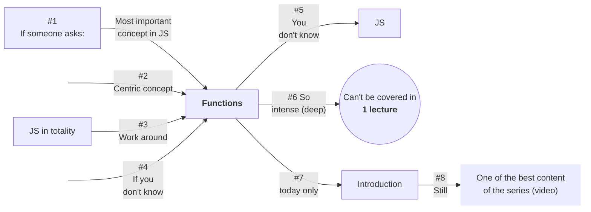
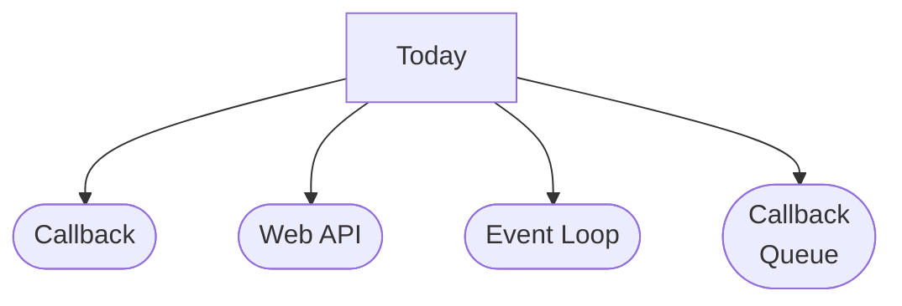
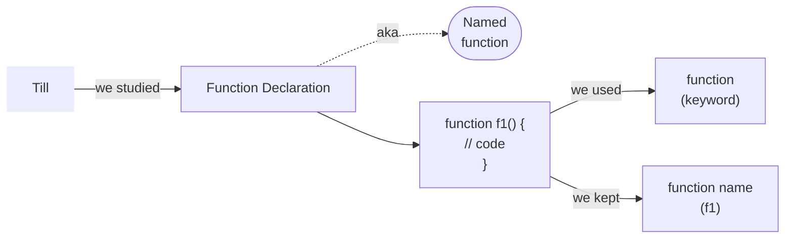
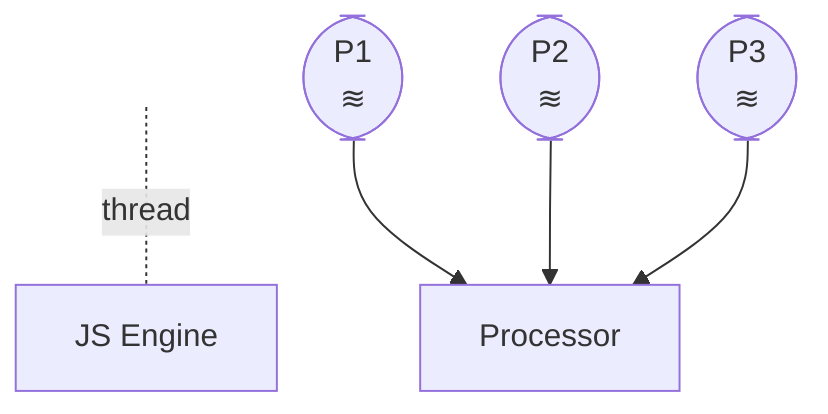
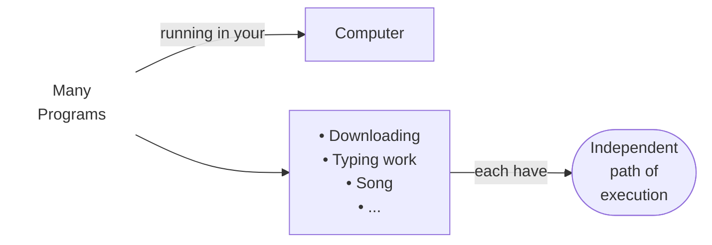
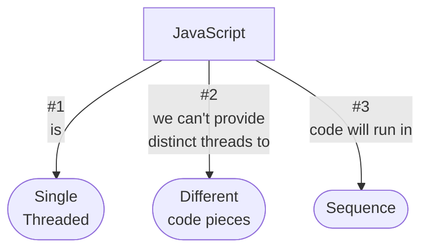
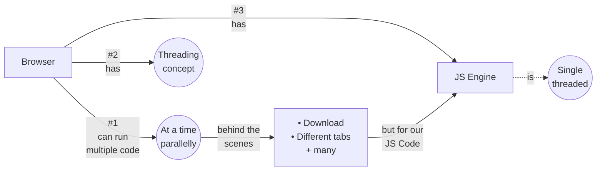
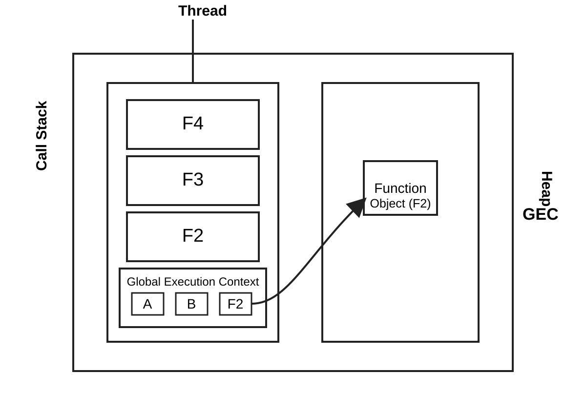

# Function Basics, Event Loop, Callback, Asynchronous JS


<details>
<summary><strong>Functions - (Extreme basics) - also in other programming languages</strong></summary>

### Examples
<details>
<summary>Eg. 1</summary>

```js
console.log("Hello1");
console.log("Hello2");
console.log("Hello3");

function f1(){
    console.log("Hello");
}
f1(); // function call
console.log("Hello4");
console.log("Hello5");
```
</details>

<details>
<summary>Eg. 2</summary>

```js
console.log("Hello1");
console.log("Hello2");
console.log("Hello3");

function f1(){
    console.log("Hello");
}
f1(); // function call
f1(); // function call
console.log("Hello4");
console.log("Hello5");
```
</details>

<details>
<summary>Eg. 3</summary>

```js
console.log("Hello1");
console.log("Hello2");
console.log("Hello3");

function f1(){
    console.log("Hello");
}
f1(); // function call
console.log("Hello4");
f1(); // function call
console.log("Hello5");
```
</details>

<details>
<summary>Eg. 4</summary>

```js
console.log("Hello1");
console.log("Hello2");
f1(); // function call
console.log("Hello3");
function f1(){
    console.log("Hello");
}
f1(); // function call
console.log("Hello4");
f1(); // function call
console.log("Hello5");
```
</details>

- _simple function examples_
- call any number of times
- not continuously, but after some gap of other lines
- also before function declaration  
`we can now understand, what's the benefit of making a function`

### 4 Types
- Takes Nothing, returns nothing
- Takes Nothing, returns something
- Takes Something, returns nothing
- Takes Something, returns something

<details>
<summary>eg.1</summary>

```js
function f1(username){
    console.log("Hello",username);
}
f1("Yash");
f1("Satish");
```
</details>

`formal argument` & `actual argument`
<details>
<summary>eg.2</summary>

```js
function f1(a,b){
    console.log("Sum is",a+b);
}
f1(10,20);
f1(30,40);
```
</details>

<details>
<summary>Eg.3</summary>

```js
function f1(a,b){
    // console.log("Sum is",a+b);
    return a+b;
}
let x=f1(10,20);
let y=f1(30,40);
console.log(x,y);
```
</details>

<details>
<summary>Eg.4</summary>

```js
function f1(){
    let a=10;
    let b=15;
    // console.log("Sum is",a+b);
    return a+b;
}
let x=f1();
let y=f1();
console.log(x,y);
```
</details>
</details>

#### + </br> more, in &nbsp;

<details>
<summary>In JavaScript</summary>
<div style="display: flex; gap: 10px;">
    <div style="flex: 0.6;">

1. Function declaration _(named function)_
2. Function expression
3. Arrow function
4. Default parameters
5. Anonymous function
6. Immediately, invoked function, expression
7. arguments Object
8. Constructor function
9. Generator function
10. Async function

- not all today
- also not one by one from today
- **at time when they required**



</div>
    <div style="flex: 1.4;">


- but
- there are many other ways also,  
    & it's not like - (10 Ways)  
    in ppt (MySirG)  
    **So, there are only 10**
- there are more +
- but
- **these 10 are** _(bare minimum)_
</div>
</div>
</details>

## Callback
<a id="callback-eg-1"></a>
<details>
<summary>eg.1</summary>

```js
function f1(){
    console.log("Hello");
}

f2(f1);

function f2(fun){
    console.log("I am in f2");
    fun();
}
```
</details>

<details>
<summary>eg.2</summary>

```js
f2(function f1(){
    console.log("Hello");
});

function f2(fun){
    console.log("I am in f2");
    fun();
}
```
</details>

- _we're passing our `f1` in `f2` function_
- `f1` is **Callback** function.
- we can make f1
- anonymous (no name)
- _we're just passing into another function (naming not necessery)_
```js
function (){

}
```
### Why it's Important! (Why इतनी बड़ी बात)?
`It is used to achieve Anynchronous Js`  
(यहाँ से कहानी शुरू होती है)  
और अब  
कहानी interesting होने वाली है

### How to achieve Anynchronous 
<div style="display: flex; gap: 10px;">
    <div style="flex: 0.6;">


</div>
    <div style="flex: 1.4;">


</div>
</div>

Processor dedicate small fractions of time to each process.  
And this  
happens very frequently so that it feels like parallel execution.  
_actually_ it's `concurrency`

<div style="display: flex; gap: 10px;">
    <div style="flex: 0.5;">

### for one program
_single path of execution_  
_all_ **instructions** _from same path_  
**in one program code:** lines one by one `(synchronous)`
</div>
    <div style="flex: 1.5;">

### for different programs
compare _P1_ and _P2_: independent paths (parallel) ➜ `(asynchronous)`  
In some other _programming language_ we can create independent path of execution.  
_it's possible to create_ for different parts of same program  
</div>
</div>  

<div style="display: flex; gap: 10px;">
    <div style="flex: 0.6;">


</div>
    <div style="flex: 1.4;">


</div>
</div>

// Call Stack, Heap, Execution Context  
// HERE  
// Notes  

<div style="display: flex; gap: 10px;">
    <div style="flex: 0.6;">

<a href="#callback-eg-1">
    
</a>
</div>
    <div style="flex: 1.4;">

- only the function whose (execution context) is at top of callstack
- executes
- the only _thread_ is busy executing the execution context at the top
</div>
</div>

<div style="display: flex; gap: 10px;">
    <div style="flex: 1;">

```js
console.log("1");   // GEC (at top of call-stack)
console.log("2");
console.log("3");
f1();               // f1's Execution context pushed (at top of call-stack)
console.log("4");
console.log("5");
f1();
console.log("6");
```
</div>
    <div style="flex: 1;">

- whenever a function is invoked
- it's execution context is created and pushed into call-stack
- and 
- the earlier execution context goes on hold
- and
- the thread becomes busy in executing the new execution context at top
- when all the instructions finishes in the context then it's popped
- and
- the other (earlier) _execution context_ resumes
</div>
</div>

### Why Callbacks?
#### 1. Asynchronous Js
> JavaScript is primarily single threaded.  
> This means it can only execute one task at a time.  
> If a long running operation:  
> like `fetching data from a server`, `reading a file` or `waiting for a timer`  
> where to block the main thread,  
> the entire browser or node.js application would freeze and become unresponsive.  

> _in our example_  
> suppose `f1` would have taken longer (like `a few seconds`)  
> then,  
> during `f1` execution  
> _page unresponsive_


<!-- <div style="display: flex; gap: 10px;">
    <div style="flex: 0.6;">
</div>
    <div style="flex: 1.4;">
<details>
<summary></summary>
</details>
</div>
</div> -->